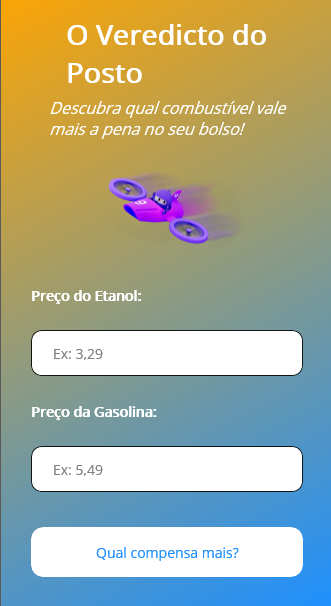

# ⛽ O Veredicto do Posto

Aplicativo simples desenvolvido com .NET MAUI + XAML, que ajuda o usuário a descobrir qual combustível compensa mais: **etanol ou gasolina**.

## 💡 Sobre o Projeto

Esse projeto foi criado como um teste prático para explorar:

- Estrutura de layout no **XAML**
- Composição de **telas responsivas**
- **Inputs numéricos** com validação
- Aplicação de **gradiente de fundo**
- Lógica de cálculo simples usando C# no backend

Ele foi desenvolvido com fins didáticos e para testar recursos visuais como:

- `Grid`, `ScrollView`, `VerticalStackLayout`
- `LinearGradientBrush` para o fundo
- Botão fixo no rodapé com estilo customizado
- Uso do `DisplayAlert` para exibir o resultado

---
## 📸 Captura de Tela
Uma prévia visual do aplicativo em funcionamento:

  

---
## ⚙️ Como Funciona

O usuário informa os preços do etanol e da gasolina, e o app aplica a regra:  
Se o preço do etanol for menor ou igual a 70% do preço da gasolina, o etanol compensa. Caso contrário, a gasolina compensa.

## 🛠️ Tecnologias Utilizadas

- .NET MAUI
- XAML
- C#

## 🚧 Status

Projeto finalizado como teste de conceito. Pode ser reaproveitado para fins educacionais, adaptação ou aprimoramento.

---

> Feito por [Nathan Fernandes](https://github.com/Nathan-Dev-udia)
